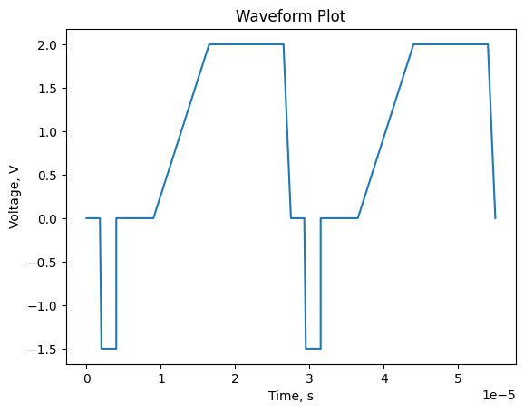
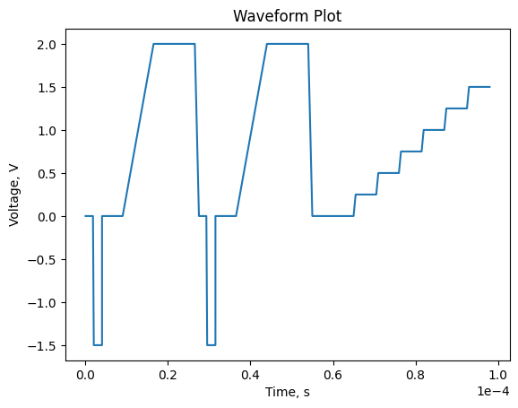
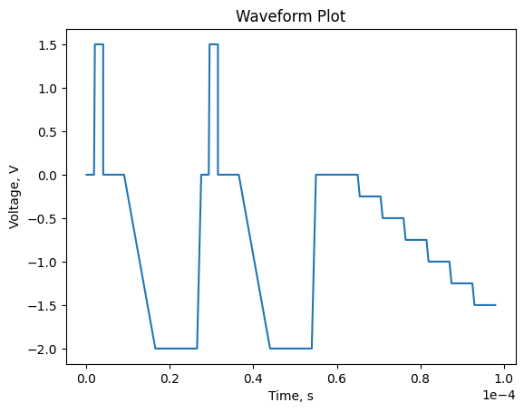

# Waveform Generator

A Python library for generating customizable waveforms and pulse sequences for signal processing applications.

[](https://www.python.org/)
[](https://github.com/ilev-sergey/waveform-generator/actions/workflows/build.yml)
[](https://github.com/ilev-sergey/waveform-generator/actions/workflows/tests.yml)

## Features

- Create and manipulate various types of pulses (Rectangular, Trapezoidal, etc.)
- Combine multiple pulses into complex sequences
- Generate waveform data for visualization or signal processing

## Installation

```bash
pip install git+https://github.com/ilev-sergey/waveform-generator.git
```

## Usage

### Basic Pulse Creation

```python
from waveform_generator import RectangularPulse, TrapezoidalPulse

# Create a rectangular pulse
rect_pulse = RectangularPulse(duration=2e-6, amplitude=-1.5, delay=2e-6)

# Create a trapezoidal pulse
trap_pulse = TrapezoidalPulse(
    pulse_width=10e-6, rise_time=7.5e-6, fall_time=1e-6, amplitude=2.0, delay=5e-6
)
```

### Creating Pulse Sequences

```python
from waveform_generator import PulseSequence

# Create a sequence of pulses
sequence = PulseSequence([rect_pulse, trap_pulse] * 2)

# Plot the sequence
sequence.plot()
```



### Manipulating Sequences

```python
from waveform_generator import StaircaseSweep

# Create a staircase sweep
sweep = StaircaseSweep(
    end_voltage=1.5, time_step=5e-6, voltage_step=0.25, edge_time=0.5e-6, delay=10e-6
)

# Add the sweep to the sequence
sequence += sweep

# Plot the updated sequence
sequence.plot()
```



```python
# Invert the sequence
inverted_sequence = -sequence

# Plot the inverted sequence
inverted_sequence.plot()
```



### Extracting data values

```python
# Get the time and voltage arrays from the sequence
times, voltages = inverted_sequence.data.values()

# Same using properties
times = inverted_sequence.times
voltages = inverted_sequence.voltages
```
